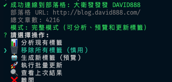

# Blogger 標籤整理工具

自動化整理 Blogger 部落格文章標籤，使用 AI 語意分析生成適合的標籤。

## 功能特色


- ✅ 使用 Google Gemini AI 進行語意分析
- ✅ 批量處理所有文章
- ✅ 預覽模式，確認後才更新
- ✅ 支援繁體中文標籤
- ✅ 信心度評分系統
- ✅ 分析現有標籤統計
- ✅ 互動式操作介面

## 安裝步驟

### 1. 安裝依賴

```bash
npm install
```

### 2. 設定 Google Cloud 專案

#### A. 建立 Google Cloud 專案
1. 前往 [Google Cloud Console](https://console.cloud.google.com/)
2. 建立新專案或選擇現有專案
3. 啟用 **Blogger API v3**

#### B. 建立 OAuth 2.0 憑證
1. 前往「APIs & Services」→「Credentials」
2. 點選「Create Credentials」→「OAuth client ID」
3. 應用程式類型選擇「Web application」
4. 新增授權重新導向 URI: `http://localhost:3000/oauth2callback`
5. 下載 Client ID 和 Client Secret

#### C. 取得 Gemini API Key
1. 前往 [Google AI Studio](https://makersuite.google.com/app/apikey)
2. 建立 API Key（免費額度：每分鐘 60 次請求）

#### D. 找到你的 Blog ID
1. 前往你的 Blogger 後台
2. 網址列會顯示：`https://www.blogger.com/blog/posts/[BLOG_ID]`
3. 複製這個 BLOG_ID

### 3. 設定環境變數

複製 `.env.example` 為 `.env`：

```bash
cp .env.example .env
```

編輯 `.env` 填入你的資訊：

```env
# 你的 Blog ID
BLOGGER_BLOG_ID=1234567890123456789

# Google OAuth 憑證
GOOGLE_CLIENT_ID=your-client-id.apps.googleusercontent.com
GOOGLE_CLIENT_SECRET=your-client-secret
GOOGLE_REDIRECT_URI=http://localhost:3000/oauth2callback

# Gemini API Key
GEMINI_API_KEY=your-gemini-api-key-here

# AI 設定
AI_PROVIDER=gemini
MAX_TAGS_PER_POST=5
MIN_TAG_CONFIDENCE=0.6

# 其他設定
BATCH_SIZE=10
DRY_RUN=true
```

## 使用方法

### 啟動工具

```bash
npm start
```

### 操作流程

1. **首次使用需要授權**
   - 工具會顯示授權網址
   - 點擊網址並授權
   - 複製授權碼貼回終端機

2. **選擇操作**
   - 📊 分析現有標籤：查看目前標籤使用統計
   - 🤖 生成新標籤：使用 AI 分析並建議新標籤
   - 🔍 查看上次結果：檢視之前的分析結果
   - 🚀 執行批量更新：確認後批量更新標籤

3. **預覽並確認**
   - 工具會顯示每篇文章的建議標籤
   - 顯示信心度評分
   - 確認無誤後才執行更新

### 範例輸出

```
===== 標籤預覽 =====

建議更新: 45 篇
信心度不足: 5 篇

✓ 1. 如何使用 Python 爬蟲抓取網頁資料
   舊標籤: Python, 教學, 爬蟲
   新標籤: Python, 網頁爬蟲, BeautifulSoup, 資料擷取
   信心度: 92%
   理由: 文章詳細介紹 Python 爬蟲技術和實作方法

✓ 2. JavaScript 非同步程式設計完全指南
   舊標籤: JS
   新標籤: JavaScript, 非同步, Promise, async/await
   信心度: 88%
   理由: 深入探討 JavaScript 非同步程式設計模式
```

## 進階設定

### 調整 AI 參數

在 `.env` 中調整：

```env
# 每篇文章最多標籤數
MAX_TAGS_PER_POST=5

# 最低信心度門檻（0.0-1.0）
MIN_TAG_CONFIDENCE=0.6

# 批次處理大小
BATCH_SIZE=10
```

### 測試模式

預設為 `DRY_RUN=true`，只會預覽不會真的更新。

確認無誤後改為 `DRY_RUN=false` 才會實際更新：

```env
DRY_RUN=false
```

## 專案結構

```
blogger-tag/
├── src/
│   ├── main.js              # 主程式（互動介面）
│   ├── blogger-client.js    # Blogger API 客戶端
│   └── tag-generator.js     # AI 標籤生成器
├── .env                     # 環境變數（不會上傳 git）
├── .env.example             # 環境變數範例
├── package.json
├── tag-results.json         # 標籤分析結果（自動生成）
└── token.json               # OAuth token（自動生成）
```

## 常見問題

### Q: 授權失敗怎麼辦？
A: 刪除 `token.json` 重新授權，確認 OAuth 設定正確。

### Q: API 配額不足？
A: Gemini 免費版每分鐘 60 次請求，工具已加入延遲避免超限。

### Q: 標籤品質不滿意？
A: 可調整 `MIN_TAG_CONFIDENCE` 提高門檻，或修改 prompt 在 `tag-generator.js`。

### Q: 想用 OpenAI 而不是 Gemini？
A: 設定 `AI_PROVIDER=openai` 並提供 `OPENAI_API_KEY`（需自行實作 OpenAI 整合）。

## 安全建議

- ✅ `.env` 已加入 `.gitignore`，不會上傳敏感資訊
- ✅ `token.json` 也不會上傳
- ✅ 建議使用環境變數而非寫死在程式碼
- ✅ 定期檢查 Google Cloud Console 的 API 使用量
